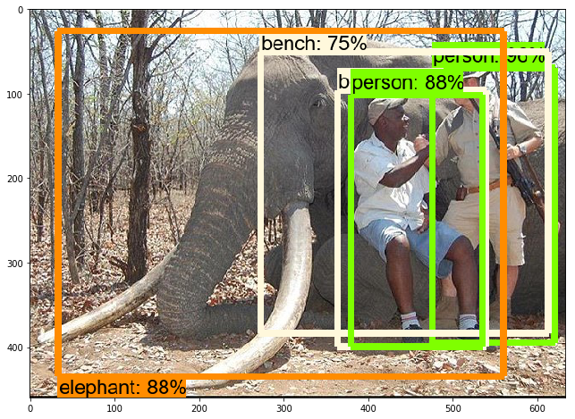
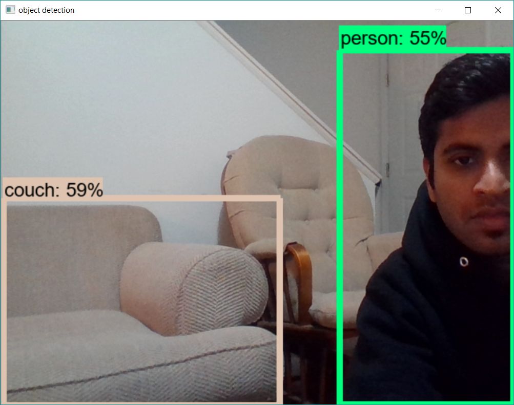

# Live_Object_Detection
#Using Tensorflow, OpenCV3

# Create conda environment 
1. conda create -n environment_name python=3.5

# Install opencv 
2. conda install --channel https://conda.anaconda.org/menpo opencv3

# Install all the dependencies using requirements.txt
3. pip install -r requirements.txt

# Result Images

